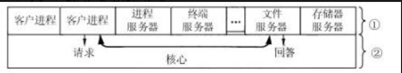
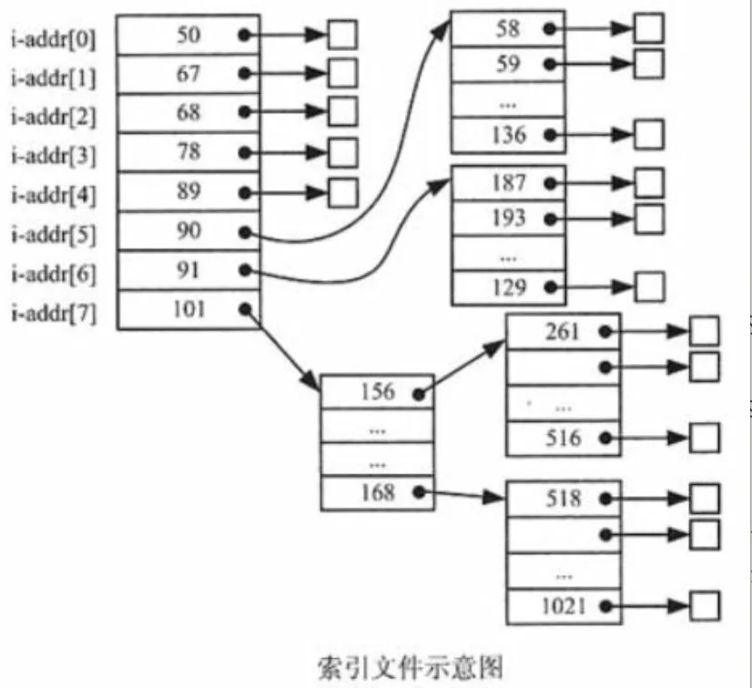

# 软考系统架构设计师 - 试题集

> 本试题集包含详细的题目解析，涵盖系统架构设计师考试的核心知识点。

## 📑 快速导航

### 操作系统相关
- [题目1：RTOS任务调度器](#题目1)
- [题目2：紧耦合多机系统通信](#题目2)
- [题目3：微内核操作系统结构](#题目3)
- [题目6：PV操作与进程同步](#题目6)
- [题目8：多核CPU进程调度](#题目8)
- [题目9：死锁避免资源计算](#题目9)
- [题目10：文件系统位示图](#题目10)
- [题目11：文件物理结构](#题目11)
- [题目12：缺页中断](#题目12)
- [题目15：死锁必要条件](#题目15)
- [题目16：信号量实现前驱关系](#题目16)
- [题目17：信号量实现进程互斥](#题目17)
- [题目18：三级调度](#题目18)
- [题目19：进程状态模型](#题目19)

### 文件系统相关
- [题目4：索引节点与多级索引](#题目4)
- [题目5：链式存储与记录成组](#题目5)

### 计算机组成与性能
- [题目13：流水线执行时间](#题目13)
- [题目14：页式存储地址类型](#题目14)

### 工作流与建模
- [题目7：工作流描述工具](#题目7)

---

## 题目1

**题干：**
以下关于实时操作系统(RTOS)任务调度器的叙述中，正确的是（  ）。

**选项：**
- A. 任务之间的公平性是最重要的调度目标
- B. 大多数RTOS调度算法都是抢占方式(可剥夺方式)
- C. RTOS调度器都采用了基于时间片轮转的调度算法
- D. 大多数RTOS调度算法只采用一种静态优先级调度算法

**答案：B**

**解析：**

**B正确：** 大多数RTOS采用抢占式(可剥夺)调度是其核心特征。当高优先级任务就绪时，可以立即中断正在运行的低优先级任务，确保系统的实时响应能力。常见的RTOS如FreeRTOS、RT-Thread、μC/OS都采用这种方式。

**A错误：** RTOS最重要的目标是**实时性**而非公平性。系统需要保证关键任务在规定时间内完成，高优先级任务应优先执行，这本身就不追求绝对公平。通用操作系统（如Windows、Linux桌面版）才更注重公平性。

**C错误：** 时间片轮转(Round-Robin)主要用于通用操作系统以保证公平性。RTOS更常用**基于优先级的抢占式调度**。即使部分RTOS使用时间片，也仅用于同优先级任务之间，且是在优先级调度基础上的补充。

**D错误：** 现代RTOS通常支持多种调度算法的组合，既有静态优先级也有动态优先级调整，还包括优先级继承、优先级天花板等机制来解决优先级反转问题。单一静态优先级无法满足复杂实时应用需求。

---


## 题目2

**题干：**
紧耦合多机系统一般通过（请作答此空）实现多机间的通信。对称多处理器结构（SMP）属于（  ）系统。

**选项：**
- A. 因特网
- B. 共享内存
- C. 进程通信
- D. 共享寄存器

**答案：B**

**解析：**

**B正确：** 紧耦合多机系统通过**共享内存**实现多机间通信。在紧耦合系统中，多个处理器通过总线或高速开关直接访问同一物理内存，通信效率高、延迟低。对称多处理器结构(SMP)是典型的紧耦合系统，所有CPU共享同一内存空间和I/O设备，地位平等。

**A错误：** 因特网是一种广域网络，用于松耦合系统或分布式系统之间的通信，延迟高、带宽相对较低，不适合紧耦合多机系统内部通信。

**C错误：** 进程通信(IPC)是一种软件层面的通信机制，包括管道、消息队列、信号量等方式。虽然紧耦合系统中也使用进程通信，但这不是多机间的**物理连接方式**，而是基于共享内存之上的软件抽象。题目问的是实现多机通信的方式，应该回答硬件层面的连接机制。

**D错误：** 共享寄存器容量太小，无法作为多机系统的主要通信方式。寄存器是CPU内部的高速存储单元，容量通常只有几个字节到几十个字节，不适合承载大量数据交换。

**知识点补充：**
- **紧耦合系统**：处理器间物理连接紧密，通过总线/开关+共享内存通信，延迟低
- **松耦合系统**：处理器间通过通道或通信线路连接，各有独立内存，延迟相对较高
- **SMP（对称多处理器）**：紧耦合的典型代表，多CPU共享内存，操作系统将其视为一个整体

---


## 题目3

**题干：**
微内核的操作系统（OS）结构如下图所示，图中①和②分别工作在（请作答此空）方式下。与传统的OS结构模式相比，采用微内核的OS结构模式的优点是提高了系统的灵活性、可扩充性，（  ）。



**选项：**
- A. 核心态和用户态
- B. 用户态和核心态
- C. 用户态和用户态
- D. 核心态和核心态

**答案：B**

**解析：**

**B正确：** 在微内核结构中，①（各种服务器）工作在**用户态**，②（微内核）工作在**核心态**。

微内核架构的核心设计思想是：将操作系统的大部分功能从内核中剥离出来，作为独立的服务器进程运行在用户态，只保留最基本、最核心的功能（如进程调度、进程间通信、中断处理、内存管理基础）在核心态运行。

**图中结构分析：**
- **①（上层服务器）**：客户进程、进程服务器、终端服务器、文件服务器、存储器服务器等，都是用户态进程
- **②（下层微内核）**：提供最基本的内核功能，运行在核心态，负责处理服务器之间的请求/回答通信

**微内核优点：**
1. **灵活性强**：各服务器独立，可以单独升级或替换
2. **可扩充性好**：添加新功能只需增加新的服务器进程
3. **可靠性高**：服务器在用户态运行，某个服务器崩溃不会导致整个系统崩溃
4. **可移植性好**：只需移植小的微内核部分，服务器代码可以保持不变

**其他选项错误原因：**
- **A错误**：顺序颠倒，服务器不能运行在核心态
- **C错误**：微内核必须运行在核心态才能管理硬件资源
- **D错误**：服务器运行在核心态会失去微内核的隔离保护优势

**对比传统OS结构（宏内核）：**
- 宏内核：所有OS功能都在核心态运行，耦合紧密，效率高但灵活性差
- 微内核：只有核心功能在核心态，其他在用户态，灵活但通信开销大

---


## 题目4

**题干：**
假设文件系统采用索引节点管理，且索引节点有8个地址项iaddr[0]～iaddr[7]，每个地址项大小为4字节，iaddr[0]～iaddr[4]采用直接地址索引，iaddr[5]和iaddr[6]采用一级间接地址索引，iaddr[7]采用二级间接地址索引。假设磁盘索引块和磁盘数据块大小均为1KB字节，文件File1的索引节点如图所示。若用户访问文件File1中逻辑块号为5和261的信息，则对应的物理块号分别为（1）；101号物理块存放的是（2）。



**问题1 [单选题]**

**选项：**
- A. 89和90
- B. 89和136
- C. 58和187
- D. 90和136

**答案：C**

**解析：**

本题考查文件系统中**索引节点**和**多级间接地址索引**的计算。

**第一步：计算每个索引块能存放多少个地址项**
- 磁盘索引块大小 = 1KB = 1024字节
- 每个地址项大小 = 4字节
- 每个索引块可存放地址项数 = 1024 ÷ 4 = **256个**

**第二步：分析8个地址项的覆盖范围**
根据题意：
- **iaddr[0]～iaddr[4]**：直接地址索引，共5个地址项
  - 覆盖逻辑块号：0～4
- **iaddr[5]～iaddr[6]**：一级间接地址索引，共2个地址项
  - iaddr[5]：覆盖逻辑块号 5～260（256个块）
  - iaddr[6]：覆盖逻辑块号 261～516（256个块）
- **iaddr[7]**：二级间接地址索引
  - 覆盖逻辑块号：517开始

**第三步：查找逻辑块5和261对应的物理块号**

**逻辑块5：**
- 逻辑块5在iaddr[5]的覆盖范围内（5～260）
- iaddr[5] = 90（从图中看出），指向90号物理块
- 90号物理块是一级间接索引表，存放256个物理块地址
- 逻辑块5是iaddr[5]中的第1个块（5-5=0，即第0个位置）
- 从图中看出，90号物理块的第一个地址项指向**58号物理块**

**逻辑块261：**
- 逻辑块261在iaddr[6]的覆盖范围内（261～516）
- iaddr[6] = 91（从图中看出），指向91号物理块
- 91号物理块是一级间接索引表
- 逻辑块261是iaddr[6]中的第1个块（261-261=0）
- 从图中看出，91号物理块的第一个地址项指向**187号物理块**

**答案：C（58和187）**

**第四步：分析101号物理块的作用**

从图中可以看到：
- iaddr[7] = 101，采用二级间接地址索引
- 101号物理块存放的是**二级间接索引表**
- 二级间接索引：101号块中存放的不是数据块地址，而是指向多个一级间接索引表的地址
- 每个一级间接索引表可以指向256个数据块
- 因此101号物理块中存放256个地址，每个地址指向一个一级间接索引表

**知识点总结：**
- **直接索引**：索引节点直接指向数据块
- **一级间接索引**：索引节点→索引块→数据块
- **二级间接索引**：索引节点→一级索引块→二级索引块→数据块
- 多级索引可以支持更大的文件，但访问速度会降低（需要多次磁盘访问）

---

## 题目5

**题干：**
某文件系统采用链式存储管理方式并应用记录的成组与分解技术，且磁盘块的大小为4096字节。若文件license.doc由7个逻辑记录组成，每个逻辑记录的大小为2048字节，并依次存放在58、89、96和101号磁盘块上，那么要存取文件的第12288逻辑字节处的信息，应访问（  ）号磁盘块。

**选项：**
- A. 58
- B. 89
- C. 96
- D. 101

**答案：D**

**解析：**

本题考查**链式存储**结合**记录成组技术**下的逻辑字节定位。

**第一步：理解记录成组技术**
- 每个逻辑记录 = 2048字节
- 每个磁盘块 = 4096字节
- 每个磁盘块可放入记录数 = 4096 ÷ 2048 = **2个逻辑记录**

**第二步：确定数据在磁盘块中的分布**

| 磁盘块号 | 存放的逻辑记录 | 对应逻辑字节范围 |
|---------|------------|--------------|
| 58 | 第1、2条记录 | 0～4095 |
| 89 | 第3、4条记录 | 4096～8191 |
| 96 | 第5、6条记录 | 8192～12287 |
| 101 | 第7条记录 | 12288～14335 |

**第三步：定位第12288逻辑字节**
- 逻辑字节从**0开始**编号
- 第12288逻辑字节落在**12288～14335**范围内
- 对应**101号磁盘块**（存放第7条记录）

**快速计算方法：**
- 12288 ÷ 4096 = 3（整除，说明恰好是第4个块的起始位置，即下标为3）
- 按顺序第4个磁盘块 = **101号**

**易错点：**
逻辑字节从0开始编号，所以第12288个逻辑字节实际是第12289个字节。12288 ÷ 4096 = 3，恰好是第4个磁盘块的起始位置，不能误判为第3个块(96号)。

---


**第四步：对比其他信号量加深理解**
- **S3、S6**：初值为0，是同步信号量。S3控制P2必须等P1先放入半成品才能开始，S6控制P3必须等P2先放入产品才能开始
- **S2**：表示B1的容量，初值为**n**（B1最多放n件）
- **S4**：表示B2的容量，初值为**m**（B2最多放m件）

**易错点：**
S1和S5看起来在P1→P2、P2→P3之间使用，容易误判为同步信号量。但关键在于它们的作用是保护B1和B2不被同时读写（互斥），而非控制先后顺序（同步）。控制先后顺序的是S3和S6。

---


## 题目6

**题干：**
某企业的生产流水线上有2名工人P1和P2，1名检验员P3。P1将初步加工的半成品放入半成品箱B1；P2从半成品箱B1取出继续加工，加工好的产品放入成品箱B2；P3从成品箱B2取出产品检验。假设B1可存放n件半成品，B2可存放m件产品，并设置6个信号量S1、S2、S3、S4、S5和S6，且S3和S6的初值都为0。采用PV操作实现P1、P2和P3的同步模型如图所示，则信号量S1和S5（  ）；S2、S4的初值分别为（  ）。

**同步流程图：**
```
P1:                    P2:                      P3:
初步加工               P(S3)                    P(S6)
P(S2)                  P(S1)                    P(S5)
P(S1)                  从B1中取半成品            从B2中取产品
半成品→B1              V(S1)                    V(S5)
V(S1)                  V(S2)                    V(S6)
V(S3)                  继续加工
                       P(S4)
                       P(S5)
                       产品→B2
                       V(S5)
                       V(S6)
```

**问题1 [单选题]**

**选项：**
- A. 分别为同步信号量和互斥信号量，初值分别为0和1
- B. 都是同步信号量，其初值分别为0和0
- C. 都是互斥信号量，其初值分别为1和1
- D. 都是互斥信号量，其初值分别为0和1

**答案：C**

**解析：**

本题考查**PV操作**中**互斥信号量和同步信号量**的区别与使用。

**第一步：明确信号量的两种用途**
- **互斥信号量**：保护共享资源，初值为1，表示资源空闲可使用
- **同步信号量**：控制进程间的先后顺序，初值为0，表示事件尚未发生

**第二步：分析S1的作用**

看P1和P2对B1的操作：
- P1写入B1之前：P(S1)（等待）；写入之后：V(S1)（释放）
- P2读出B1之前：P(S1)（等待）；读出之后：V(S1)（释放）

S1保护的是**半成品箱B1**，P1和P2不能同时访问B1，属于对共享资源的**互斥访问**。因此S1是**互斥信号量，初值为1**（表示B1初始时空闲可访问）。

**第三步：分析S5的作用**

看P2和P3对B2的操作：
- P2写入B2之前：P(S5)（等待）；写入之后：V(S5)（释放）
- P3读出B2之前：P(S5)（等待）；读出之后：V(S5)（释放）

S5保护的是**成品箱B2**，P2和P3不能同时访问B2，同样是**互斥访问**。因此S5是**互斥信号量，初值为1**。

**第四步：对比其他信号量加深理解**
- **S3、S6**：初值为0，是同步信号量。S3控制P2必须等P1先放入半成品才能开始，S6控制P3必须等P2先放入产品才能开始
- **S2**：表示B1的容量，初值为**n**（B1最多放n件）
- **S4**：表示B2的容量，初值为**m**（B2最多放m件）

**易错点：**
S1和S5看起来在P1→P2、P2→P3之间使用，容易误判为同步信号量。但关键在于它们的作用是保护B1和B2不被同时读写（互斥），而非控制先后顺序（同步）。控制先后顺序的是S3和S6。

---

## 题目7

**题干：**
工作流表示的是业务过程模型，通常使用图形形式来描述，以下不可用来描述工作流的是（  ）。

**选项：**
- A. 活动图
- B. BPMN
- C. 用例图
- D. Petri-Net

**答案：C**

**解析：**

本题考查**工作流建模**常用的图形工具。关键在于区分"描述业务流程"和"描述系统功能需求"的区别。

**C正确（不可用于描述工作流）：** 用例图的职责是描述**系统功能需求**和**用户与系统的交互行为**，关注的是"系统能做什么"，而非业务流程的内部逻辑和执行顺序。它没有表示流程先后顺序、分支、并发等概念，因此不适合用来描述工作流。

**A错误（可以描述工作流）：** 活动图可以用来描述系统的工作流程和并发行为。它支持顺序执行、分支、合并、并发等流程控制，可以清晰地表示一个业务过程从开始到结束的流转逻辑。

**B错误（可以描述工作流）：** BPMN（Business Process Modeling Notation）是专门为**业务过程建模**设计的标准符号语言，是描述工作流最常用的工具之一，天然适合表示企业的业务流程。

**D错误（可以描述工作流）：** Petri-Net（佩特里网）是流程建模的经典工具，被称为"所有流程定义语言之母"。它能精确表示顺序、并发、互斥、同步等复杂的流程关系，广泛用于工作流建模和分析。

**快速判断技巧：**
问"能不能描述工作流"，关键看该工具是否能表示**流程的先后顺序和控制逻辑**。用例图只关注功能需求，无流程概念，是唯一的排除项。

---

## 题目8

**题干：**
关于多核CPU环境下进程的调度算法，以下说法正确的是（  ）。

**选项：**
- A. 全局队列调度优点是缓存利用率高
- B. 全局队列调度缺点是CPU利用率低
- C. 局部队列调度优点是从全局任务等待队列中选取就绪任务并执行
- D. 局部队列调度缺点是CPU利用率低

**答案：D**

**解析：**

本题考查多核CPU环境下**全局队列调度**和**局部队列调度**的优缺点对比。

**核心区别先明确：**

| | 全局队列调度 | 局部队列调度 |
|---|---|---|
| 队列结构 | 所有CPU共享一个任务队列 | 每个CPU维护自己的局部队列 |
| 选取方式 | 任何空闲CPU都可从全局队列取任务 | CPU只从自己的队列取任务 |

**逐项分析：**

**A错误：** 全局队列调度的优点是**CPU利用率高**，而非缓存利用率高。因为任务可以被任意CPU调度，空闲CPU总能找到可执行的任务，资源利用充分。但恰恰因为任务可能在不同CPU间迁移，缓存利用率反而较低。

**B错误：** 全局队列调度的缺点恰恰相反，是CPU利用率**高**。它的缺点是缓存利用率低和队列竞争开销（多个CPU同时访问全局队列需要加锁）。

**C错误：** 描述的是**全局队列调度**的特点，不是局部队列调度。局部队列调度是每个CPU只从自己的局部队列中选取任务，不涉及全局队列。

**D正确：** 局部队列调度的优点是任务基本绑定在同一CPU上执行，**缓存利用率高**（局部缓存命中率高），且无需竞争全局队列。但缺点是当某个CPU的队列为空而其他CPU队列还有大量任务时，空闲CPU无法获取任务，导致**CPU利用率低**。

**易错点：**
容易混淆两种调度各自的优缺点。简单记忆：
- **全局队列** → CPU利用率高，缓存利用率低
- **局部队列** → 缓存利用率高，CPU利用率低

---

## 题目9

**题干：**
若系统中有5个进程共享同类资源，每个进程最多需要3个资源，则系统最少需提供（  ）个资源才能避免死锁。

**选项：**
- A. 10
- B. 11
- C. 12
- D. 15

**答案：B**

**解析：**

本题考查**死锁避免**中最少资源数的计算公式。

**公式：**
$$M = N \times (K - 1) + 1$$

其中：
- N = 进程数
- K = 每个进程最大需求量
- M = 避免死锁所需的最少资源数

**推导思路：**

最坏情况是每个进程都**刚好拿到不够用的资源，然后都在等**。每个进程最多需要K个资源，那么每个进程最多可能已经拿到 K-1 个而无法继续执行。此时N个进程共占用 N×(K-1) 个资源，系统全部资源都被占用且无人能完成任务，就会死锁。

因此只要**再多1个资源**，就能让至少一个进程拿到第K个资源完成执行并释放，系统就能继续推进，避免死锁。

**代入计算：**
- N = 5，K = 3
- M = 5 × (3 - 1) + 1 = 5 × 2 + 1 = **11**

**各选项分析：**
- **A（10）**：即 5×2，是最坏情况下每个进程各拿2个时的总量，此时恰好全部卡住，会死锁
- **B（11）**：正确，多出的1个资源保证至少一个进程能完成
- **C（12）**：满足条件但不是最少
- **D（15）**：即 5×3，所有进程都能同时获得最大需求量，远超最少需求

**易错点：**
容易直接算 N×K=15 或 N×(K-1)=10。记住公式核心逻辑：**最坏情况 + 1**，那个+1是关键。

---

## 题目10

**题干：**
文件系统中，位示图（Bitmap）的作用是（  ）。

**选项：**
- A. 记录文件的创建时间
- B. 索引文件内容
- C. 存储文件的访问权限
- D. 管理磁盘空闲块

**答案：D**

**解析：**

本题考查文件系统中**位示图（Bitmap）**的用途和磁盘空闲空间管理方法。

**D正确：** 位示图是磁盘空闲空间管理的经典方法。其核心原理是用一个二进制数组，**每一位对应磁盘上一个块**，用0和1来标记该块的状态：

- **0** → 该块空闲，可以分配给新文件
- **1** → 该块已被占用

例如，假设磁盘共有8个块，位示图为 `10110010`，则表示第1、3、4、7号块已占用，第2、5、6、8号块空闲。

**位示图的工作流程：**
- **分配空间时**：扫描位示图，找到值为0的位，将其置为1，将对应块分配给文件
- **释放空间时**：文件删除后，将对应块在位示图中的值从1置为0，标记为空闲

**位示图的优缺点：**
- 优点：结构简单，查找空闲块速度快，空间开销小（每个块只占1 bit）
- �点：分配时需要遍历位示图找空闲块，当磁盘很大时扫描耗时

**与其他空闲空间管理方法对比：**

| 方法 | 原理 | 特点 |
|------|------|------|
| **位示图** | 用一位表示每个块的状态 | 简单高效，本题考查对象 |
| 空闲块链表 | 将所有空闲块用链表串联 | 分配快，但遍历链表开销大 |
| 空闲区表 | 记录连续空闲区的起始块和长度 | 适合连续分配，碎片多时效率低 |

**A错误：** 文件的创建时间属于**文件元数据**，记录在inode（索引节点）或目录项中。inode通常存储文件的创建时间、修改时间、访问时间、文件大小、权限等信息，与位示图完全无关。

**B错误：** 索引文件内容是**索引节点（inode）或索引块**的功能。索引节点负责将文件的逻辑块号映射到物理块号，告诉系统文件数据具体存在磁盘哪里。位示图只关心块是否空闲，不关心块里存的是什么文件的数据。

**C错误：** 文件的访问权限（读r、写w、执行x）也记录在**inode**中。例如Linux系统中，每个文件的权限用9个位表示（rwxrwxrwx），分别对应所有者、组、其他人的权限，这些信息存在inode里，位示图不涉及。

**易错点：**
位示图名中含"位"字，容易与其他"位"相关的概念混淆。记住一句话：**位示图 = 磁盘块的黑白名单**，1就是黑名单（已占用），0就是白名单（空闲），专门用来管理空闲空间。

---
## 题目11

**题干：**
在文件系统中，用于表示文件物理结构的类型不包括（  ）。

**选项：**
- A. 连续结构
- B. 链接结构
- C. 索引结构
- D. 散列结构

**答案：D**

**解析：**

本题考查**文件物理结构**的基本类型。

**D正确（不属于文件物理结构）：** 散列结构（哈希结构）是一种**数据组织和检索技术**，主要用于快速查找和定位数据，如哈希表、散列文件的记录查找等。它不是用来表示文件在磁盘上如何存储的物理结构类型。

**文件物理结构的三种基本类型：**

| 结构类型 | 原理 | 优点 | 缺点 |
|---------|------|------|------|
| **连续结构** | 文件数据存放在磁盘上连续的物理块中 | 顺序访问和随机访问都快，磁头移动少 | 文件扩展困难，易产生外部碎片 |
| **链接结构** | 每个物理块包含指向下一块的指针，形成链表 | 文件扩展方便，无外部碎片 | 只能顺序访问，随机访问效率低，指针占用空间 |
| **索引结构** | 为每个文件建立索引表，记录逻辑块到物理块的映射 | 支持随机访问，文件扩展方便 | 需要额外的索引表空间，小文件开销大 |

**A错误（属于文件物理结构）：** 连续结构是最简单的文件物理结构，文件占用一组连续的磁盘块。只需记录起始块号和文件长度即可定位整个文件。

**B错误（属于文件物理结构）：** 链接结构通过指针将分散的磁盘块链接起来。包括隐式链接（每块末尾存指针）和显式链接（使用文件分配表FAT）两种方式。

**C错误（属于文件物理结构）：** 索引结构为文件建立独立的索引块，索引块中存放文件各逻辑块对应的物理块号。Unix/Linux的inode就是采用索引结构，支持多级索引以管理大文件。

**散列结构的实际用途：**
- 散列文件中记录的快速定位（根据关键字计算存储位置）
- 数据库索引中的哈希索引
- 内存中的哈希表数据结构

**易错点：**
容易将"散列结构"与"索引结构"混淆。散列是一种**检索技术**，解决的是"如何快速找到记录"的问题；而索引结构是一种**存储结构**，解决的是"文件数据块如何在磁盘上组织"的问题。

---


## 题目12

**题干：**
以下情况会触发缺页中断（Page Fault）的是（  ）。

**选项：**
- A. 进程访问的页在物理内存中
- B. 进程访问的页被标记为只读
- C. 进程访问的页既不在内存也不在磁盘
- D. 进程访问的页不在物理内存但存在于磁盘

**答案：D**

**解析：**

本题考查**虚拟内存管理**中**缺页中断**的触发条件。

**D正确：** 缺页中断发生在进程访问的页面**不在物理内存但存在于磁盘**（交换区/页面文件）时。此时操作系统会：
1. 暂停当前进程
2. 从磁盘将所需页面调入物理内存
3. 更新页表，将该页标记为"在内存中"
4. 恢复进程执行

这是虚拟内存"按需调页"机制的核心——只有真正需要访问时才将页面调入内存。

**A错误：** 如果页面已在物理内存中，CPU通过页表直接获得物理地址，正常访问，不会产生任何中断。

**B错误：** 访问只读页面时：
- 如果是**读操作**：正常执行，不产生中断
- 如果是**写操作**：产生的是**保护异常/段错误（Segmentation Fault）**，不是缺页中断

**C错误：** 如果页面既不在内存也不在磁盘，说明该地址根本不属于进程的合法地址空间。此时产生的是**访问违例/段错误**，操作系统通常会终止该进程，而不是缺页中断。

**缺页中断 vs 其他异常对比：**

| 情况 | 产生的异常 | 处理方式 |
|------|-----------|---------|
| 页不在内存但在磁盘 | **缺页中断** | 从磁盘调入页面，进程继续执行 |
| 页不存在（非法地址） | 段错误/访问违例 | 终止进程 |
| 写只读页面 | 保护异常 | 终止进程或触发写时复制(COW) |
| 权限不足 | 保护异常 | 终止进程 |

**易错点：**
选项C容易误选。关键区别：缺页中断是**可恢复的**，页面虽然暂时不在内存，但数据在磁盘上，可以调入后继续执行；而C选项描述的是非法访问，是**不可恢复的**错误。

---
## 题目13

**题干：**
某流水线系统有5个功能段，每段执行时间分别为2ns、3ns、1ns、4ns、2ns。若该系统需要连续处理100条指令，则总执行时间为（  ）。

**选项：**
- A. 416ns
- B. 408ns
- C. 420ns
- D. 424ns

**答案：B**

**解析：**

本题考查**流水线执行时间**的计算公式。

**流水线总执行时间公式：**
$$T = T_1 + (n - 1) \times \Delta t$$

其中：
- $T_1$ = 第一条指令的执行时间（流过所有功能段的时间）
- $n$ = 指令总条数
- $\Delta t$ = 流水线周期（最长功能段的执行时间）

**计算步骤：**

**第一步：计算第一条指令执行时间 $T_1$**
- $T_1$ = 2 + 3 + 1 + 4 + 2 = **12ns**

**第二步：确定流水线周期 $\Delta t$**
- 流水线周期 = 各功能段中**最长**的执行时间 = **4ns**
- （流水线按最慢的功能段节拍推进，否则会产生阻塞）

**第三步：代入公式计算**
- $T$ = 12 + (100 - 1) × 4
- $T$ = 12 + 99 × 4
- $T$ = 12 + 396 = **408ns**

**流水线原理图解：**
```
指令1: [2ns][3ns][1ns][4ns][2ns]  → 第1条完成
指令2:      [2ns][3ns][1ns][4ns][2ns]
指令3:           [2ns][3ns][1ns][4ns][2ns]
...
```
- 第1条指令需要完整走完5个阶段（12ns）
- 之后每隔一个流水线周期（4ns）就有一条指令完成

**其他选项分析：**
- **A（416ns）**：可能误将流水线周期算成某个错误值
- **C（420ns）**：可能用了 n×Δt 而非 (n-1)×Δt
- **D（424ns）**：计算错误

**易错点：**
1. 流水线周期取**最长段**，不是平均值
2. 公式中是 **(n-1)** 而非 n，因为第一条指令已包含在 $T_1$ 中

---
## 题目14

**题干：**
在页式存储管理中，以下哪种地址类型用于程序运行时在内存中的实际定位（  ）。

**选项：**
- A. 逻辑地址
- B. 物理地址
- C. 虚拟地址
- D. 相对地址

**答案：B**

**解析：**

本题考查**页式存储管理**中各种地址类型的概念与用途。

**B正确：** 物理地址是程序运行时在**内存中的实际地址**，由**页帧号（物理块号）+ 页内偏移**组成。CPU最终通过物理地址访问内存芯片上的具体存储单元。

**地址转换过程：**
```
逻辑地址（页号+页内偏移）
        ↓ 查页表
物理地址（页帧号+页内偏移）
        ↓
访问实际内存单元
```

**各地址类型对比：**

| 地址类型 | 含义 | 用途 |
|---------|------|------|
| **逻辑地址** | 程序中使用的地址，由页号+页内偏移组成 | 程序编写时使用，需转换后才能访问内存 |
| **物理地址** | 内存中的实际地址，由页帧号+页内偏移组成 | **实际定位内存单元**（本题答案） |
| **虚拟地址** | 通常与逻辑地址同义，是程序"看到"的地址空间 | 提供比物理内存更大的地址空间假象 |
| **相对地址** | 相对于某个基址的偏移量 | 可重定位程序中使用，加载时需重定位 |

**A错误：** 逻辑地址是程序员/编译器视角的地址，程序中写的地址都是逻辑地址。它不能直接用于访问内存，必须通过**页表转换**为物理地址。

**C错误：** 虚拟地址在大多数语境下与逻辑地址等价，都是程序"认为"自己使用的地址，而非实际的内存地址。虚拟地址需要通过MMU（内存管理单元）转换为物理地址。

**D错误：** 相对地址是相对于程序起始位置或某个基址的偏移量，主要用于**可重定位代码**。程序加载到内存时，需要将相对地址加上基址才能得到实际地址，不直接用于页式存储的内存定位。

**易错点：**
虚拟地址和逻辑地址容易混淆。在页式存储管理的语境下：
- **逻辑地址 ≈ 虚拟地址**：都是程序使用的地址，需要转换
- **物理地址**：才是内存中的真实位置

---
## 题目15

**题干：**
在操作系统中，以下哪个条件不是产生死锁的必要条件（  ）。

**选项：**
- A. 资源共享
- B. 保持和等待
- C. 不可剥夺
- D. 环路等待

**答案：A**

**解析：**

本题考查**死锁产生的四个必要条件**。

**死锁的四个必要条件（缺一不可）：**

| 条件 | 含义 | 说明 |
|------|------|------|
| **互斥条件** | 资源一次只能被一个进程使用 | 如打印机、写文件等 |
| **保持和等待** | 进程持有资源的同时又请求新资源 | 占着已有资源不放，还要更多 |
| **不可剥夺** | 进程已获得的资源不能被强制夺走 | 只能由进程自己释放 |
| **环路等待** | 存在进程-资源的循环等待链 | P1等P2，P2等P3，P3等P1 |

**A正确（不是死锁必要条件）：** 资源共享是多进程系统的**普遍特征**，是操作系统的基本功能，但它本身并不直接导致死锁。实际上，死锁的第一个必要条件是**互斥**，而非资源共享。

**B错误（是死锁必要条件）：** 保持和等待是死锁的必要条件。进程在请求新资源被阻塞时，不释放已占有的资源，这是形成死锁的关键因素之一。

**C错误（是死锁必要条件）：** 不可剥夺是死锁的必要条件。如果系统可以强制剥夺进程的资源，就不会形成死锁僵局。

**D错误（是死锁必要条件）：** 环路等待是死锁的必要条件。死锁状态下必然存在一个进程等待链形成闭环。

**互斥 vs 资源共享的区别：**
- **互斥**：强调资源在**同一时刻**只能被一个进程独占使用
- **资源共享**：强调资源可以被**多个进程**使用（可能是分时、轮流使用）

**易错点：**
容易将"资源共享"误认为是"互斥条件"的另一种说法。实际上两者含义相反：
- 互斥 = 资源**独占**使用 → 是死锁条件
- 资源共享 = 资源可**共同**使用 → 不是死锁条件

**记忆口诀：** 死锁四条件 = **互保不环**（互斥、保持等待、不可剥夺、环路等待）

---
## 题目16

**题干：**
在使用信号量实现前驱关系时，以下哪个步骤是正确的（  ）。

**选项：**
- A. 设置的信号量数量等于进程数
- B. 所有信号量的初始值设为1
- C. 进程执行前进行V操作，执行后进行P操作
- D. 信号量数量等于有向边数量，初始值为0

**答案：D**

**解析：**

本题考查**使用信号量实现进程间的前驱关系（同步）**。

**D正确：** 使用信号量实现前驱关系的核心规则：
1. **信号量数量 = 有向边数量**（每条前驱边对应一个信号量）
2. **信号量初始值 = 0**（表示前驱事件尚未发生）

**前驱关系实现原理：**

假设有前驱关系 P1 → P2（P1必须在P2之前执行）：
```
信号量 S = 0（初始值）

P1进程:                    P2进程:
  执行P1的操作               P(S)  ← 等待P1完成
  V(S)  ← 通知P2可以开始      执行P2的操作
```

**执行流程：**
- P2先执行P(S)，因S=0被阻塞
- P1执行完后V(S)，S变为1
- P2被唤醒，继续执行

**各选项分析：**

**A错误：** 信号量数量应等于**有向边数量**，而非进程数。例如：
```
P1 → P2 → P3  （2条边，需要2个信号量）
P1 → P2
  ↘ P3        （2条边，需要2个信号量）
```

**B错误：** 同步信号量初始值应为**0**，表示"事件尚未发生"。初始值为1是**互斥信号量**的特征。

**C错误：** 顺序完全相反！正确的是：
- **前驱进程**：执行后V操作（释放/通知）
- **后继进程**：执行前P操作（等待/申请）

**信号量类型对比：**

| 类型 | 初始值 | 用途 | P/V顺序 |
|------|--------|------|---------|
| **互斥信号量** | 1 | 保护临界资源 | 进入前P，退出后V |
| **同步信号量** | 0 | 实现前驱关系 | 前驱V，后继P |

**易错点：**
1. 混淆互斥信号量（初值1）和同步信号量（初值0）
2. 记反P/V操作顺序：**前驱V后继P**，不是相反

---
## 题目17

**题干：**
在使用信号量实现进程互斥时，以下哪个描述是正确的（  ）。

**选项：**
- A. 互斥信号量的初始值应设置为0
- B. P操作会增加信号量的值
- C. V操作在进入临界区之前执行
- D. 互斥信号量的初始值通常设置为1

**答案：D**

**解析：**

本题考查**使用信号量实现进程互斥**的基本原理。

**D正确：** 互斥信号量（mutex）的初始值通常设置为**1**，表示临界资源最初是**可用的**，允许一个进程进入临界区。

**互斥访问临界区的标准模板：**
```
semaphore mutex = 1;  // 互斥信号量，初值为1

进程Pi:
    P(mutex);         // 进入区：申请资源
    临界区代码;        // 访问共享资源
    V(mutex);         // 退出区：释放资源
    剩余区;
```

**各选项分析：**

**A错误：** 互斥信号量初始值应为**1**，不是0。
- 初值为1 → 互斥信号量（表示资源可用）
- 初值为0 → 同步信号量（表示事件未发生）

**B错误：** P操作是**减少**信号量的值，不是增加。
- **P操作**：S = S - 1（申请资源，可能阻塞）
- **V操作**：S = S + 1（释放资源，可能唤醒）

**C错误：** V操作在**离开临界区之后**执行，用于释放资源；不是在进入之前。
- 进入临界区**之前**：执行**P操作**（申请）
- 离开临界区**之后**：执行**V操作**（释放）

**P/V操作详解：**

| 操作 | 全称 | 含义 | 对信号量的影响 |
|------|------|------|---------------|
| **P** | Proberen（荷兰语"测试"） | 申请资源 | S = S - 1，若S<0则阻塞 |
| **V** | Verhogen（荷兰语"增加"） | 释放资源 | S = S + 1，若S≤0则唤醒一个等待进程 |

**信号量值的含义：**
- S > 0：有S个资源可用
- S = 0：无可用资源，无等待进程
- S < 0：|S|个进程在等待

**易错点：**
1. P/V操作容易记反：**P减V加**
2. 互斥和同步的初值容易混淆：**互斥1，同步0**

---
## 题目18

**题干：**
在操作系统中，哪种调度不涉及进程在内存和外存之间的交换（  ）。

**选项：**
- A. 高级调度
- B. 中级调度
- C. 低级调度
- D. 实时调度

**答案：C**

**解析：**

本题考查**操作系统的三级调度模型**及其各自的职责范围。

**C正确：** 低级调度（进程调度/CPU调度）是在**内存中的就绪队列**中选择进程分配CPU，整个过程都在内存中完成，**不涉及内存和外存之间的数据交换**。

**操作系统三级调度详解：**

```
┌─────────────────────────────────────────────────────────────┐
│                         外存（磁盘）                          │
│    ┌─────────────────────────────────────────────────┐     │
│    │              后备队列（作业池）                    │     │
│    │         等待被调入内存的作业/程序                  │     │
│    └─────────────────────────────────────────────────┘     │
└─────────────────────────────────────────────────────────────┘
                    ↑↓ 高级调度（作业调度）
                    ↑↓ 中级调度（内存调度）
┌─────────────────────────────────────────────────────────────┐
│                          内存                               │
│  ┌──────────────┐    低级调度     ┌──────────────┐         │
│  │   就绪队列    │ ─────────────→ │     CPU      │         │
│  │ (等待CPU的   │ ←───────────── │   （运行）    │         │
│  │   进程)      │   时间片用完     └──────────────┘         │
│  └──────────────┘                                          │
└─────────────────────────────────────────────────────────────┘
```

**三级调度对比表：**

| 调度类型 | 别名 | 调度对象 | 发生位置 | 是否涉及内外存交换 | 频率 |
|---------|------|---------|---------|------------------|------|
| **高级调度** | 作业调度、长程调度 | 作业 | 外存→内存 | **是**（调入） | 最低 |
| **中级调度** | 内存调度、交换调度 | 进程 | 内存↔外存 | **是**（换入换出） | 中等 |
| **低级调度** | 进程调度、CPU调度、短程调度 | 进程 | 内存内部 | **否** | 最高 |

**各调度详细说明：**

**A. 高级调度（作业调度）**
- **职责**：从外存的后备队列中选择作业，调入内存并创建进程
- **触发时机**：内存有空闲空间时
- **调度算法**：FCFS、SJF、优先级、高响应比等
- **涉及内外存交换**：是（将作业从外存**调入**内存）

**B. 中级调度（内存调度/交换调度）**
- **职责**：将暂时不能运行的进程换出到外存（挂起），需要时再换入内存
- **触发时机**：内存紧张或进程长时间等待时
- **目的**：提高内存利用率，支持虚拟存储
- **涉及内外存交换**：是（进程在内存和外存之间**双向交换**）

**C. 低级调度（进程调度/CPU调度）**
- **职责**：从内存的就绪队列中选择一个进程，分配CPU给它运行
- **触发时机**：
  - 当前进程时间片用完
  - 当前进程阻塞（等待I/O）
  - 有更高优先级进程就绪（抢占式）
- **调度算法**：时间片轮转、优先级、多级反馈队列等
- **涉及内外存交换**：**否**（仅在内存中的就绪进程之间调度）

**D. 实时调度**
- 不属于标准的三级调度模型
- 是一种特殊的调度策略，用于实时操作系统
- 本题作为**干扰项**

**进程状态转换与调度的关系：**

```
                    高级调度
        创建 ─────────────────→ 就绪
                                 │
                          低级调度│（分配CPU）
                                 ↓
        终止 ←─────────────── 运行
                                 │
                                 │ I/O请求
                                 ↓
                               阻塞
                                 │
                          中级调度│（换出/换入）
                                 ↓
                            挂起状态
```

**易错点：**
1. 容易混淆三级调度的层次关系
2. 记住关键区分点：**低级调度只在内存内部进行**，是唯一不涉及内外存交换的调度
3. 实时调度是调度策略，不是调度层次

**记忆技巧：**
- **高**级 → 作业从**外**存进内存（高高在上，从外面来）
- **中**级 → 内存↔外存**双向**交换（中间人，两边跑）
- **低**级 → 只在内存**内部**调度CPU（低头干活，不出门）

---
## 题目19

**题干：**
在操作系统中，进程状态模型包括三态模型和五态模型。关于这两种模型，以下说法正确的是（  ）。

**选项：**
- A. 三态模型包括就绪、运行和阻塞三种状态
- B. 五态模型比三态模型多了挂起和终止两种状态
- C. 三态模型适用于所有类型的操作系统，而五态模型仅适用于分时系统
- D. 五态模型中不存在就绪状态

**答案：A**

**解析：**

本题考查**进程状态模型**的基本概念和状态转换。

**A正确：** 三态模型是进程状态的**基本模型**，包含三种核心状态：
- **就绪（Ready）**：进程已获得除CPU外的所有资源，等待CPU调度
- **运行（Running）**：进程正在CPU上执行
- **阻塞（Blocked/Wait）**：进程因等待某事件（如I/O完成）而暂停执行

---

**三态模型状态转换图：**

```
                    ┌─────────────────────────┐
                    │                         │
                    ↓          时间片用完       │
              ┌──────────┐ ←────────────── ┌──────────┐
              │          │                 │          │
              │   就绪    │ ──────────────→ │   运行   │
              │ (Ready)  │   获得CPU调度    │(Running) │
              └──────────┘                 └──────────┘
                    ↑                           │
                    │                           │
                    │ I/O完成                    │ 请求I/O
                    │ 事件发生                   │ 等待事件
                    │                           ↓
              ┌──────────────────────────────────────┐
              │              阻塞 (Blocked)           │
              └──────────────────────────────────────┘
```

**三态之间的转换条件：**

| 转换 | 触发条件 | 说明 |
|------|---------|------|
| 就绪→运行 | 被调度程序选中 | 获得CPU使用权 |
| 运行→就绪 | 时间片用完/被抢占 | 失去CPU但仍可运行 |
| 运行→阻塞 | 请求I/O/等待事件 | 主动放弃CPU等待 |
| 阻塞→就绪 | I/O完成/事件发生 | 等待的事件已满足 |

**注意**：不存在"阻塞→运行"和"就绪→阻塞"的直接转换！

---

**五态模型详解：**

五态模型在三态基础上增加了**创建态**和**终止态**：

```
┌────────┐      ┌────────┐      ┌────────┐      ┌────────┐
│        │      │        │      │        │      │        │
│  创建   │ ───→│  就绪   │ ←──→│  运行   │ ───→│  终止   │
│(New)   │      │(Ready) │      │(Running)│      │(Exit)  │
└────────┘      └────────┘      └────────┘      └────────┘
                     ↑               │
                     │               │
                     └─── 阻塞 ←─────┘
                        (Blocked)
```

**五态模型的五种状态：**

| 状态 | 英文 | 含义 |
|------|------|------|
| **创建态** | New | 进程正在被创建，分配资源、初始化PCB |
| **就绪态** | Ready | 已获得除CPU外的所有资源，等待调度 |
| **运行态** | Running | 正在CPU上执行 |
| **阻塞态** | Blocked | 等待某事件发生而暂停 |
| **终止态** | Exit/Terminated | 进程执行完毕或被终止，等待回收资源 |

---

**各选项分析：**

**B错误：** 五态模型比三态模型多了**创建态和终止态**，不是"挂起和终止"。
- 三态：就绪、运行、阻塞
- 五态：**创建** + 就绪、运行、阻塞 + **终止**

**挂起状态**属于**七态模型**（或带挂起的五态模型），是更复杂的扩展模型。

**C错误：** 三态模型和五态模型都是通用的进程状态模型，**适用于各种类型的操作系统**，不仅限于分时系统。实时系统、批处理系统等都可以使用这些模型。

**D错误：** 五态模型中**仍然存在就绪状态**，它是三态的核心状态之一，在五态模型中被完整保留。

---

**扩展：七态模型（带挂起状态）**

当引入**虚拟内存**和**交换技术**时，需要增加挂起状态：

```
┌─────────────────────────────────────────────────────┐
│                      内存中                          │
│    创建 → 就绪 ←→ 运行 → 终止                        │
│              ↑       │                              │
│              └─ 阻塞 ←┘                              │
└─────────────────────────────────────────────────────┘
                ↑↓         ↑↓
         ┌──────────────────────────────────────┐
         │              外存中（挂起）            │
         │      就绪挂起  ←→  阻塞挂起           │
         └──────────────────────────────────────┘
```

七态模型的状态：
1. 创建态
2. 就绪态
3. 运行态
4. 阻塞态
5. 终止态
6. **就绪挂起态**（在外存，一旦调入内存即可运行）
7. **阻塞挂起态**（在外存，且在等待事件）

---

**各模型对比总结：**

| 模型 | 包含状态 | 特点 |
|------|---------|------|
| **三态模型** | 就绪、运行、阻塞 | 最基本的核心模型 |
| **五态模型** | 创建、就绪、运行、阻塞、终止 | 增加进程生命周期的起止状态 |
| **七态模型** | 五态 + 就绪挂起、阻塞挂起 | 支持虚拟内存和进程交换 |

**易错点：**
1. B选项的陷阱：五态增加的是**创建和终止**，不是挂起
2. 挂起状态属于七态模型，不属于标准五态模型
3. 三态是五态的子集，五态是七态的子集

---
## 题目20

**题干：**
CORBA架构中，作为"软总线"的是（  ）。

**选项：**
- A. 公共设施
- B. 公共对象服务
- C. 对象请求代理
- D. 对象适配器

**答案：C**

**解析：**

本题考查**CORBA（公共对象请求代理架构）**的核心组件。

**C正确：** 对象请求代理（Object Request Broker，**ORB**）是CORBA架构的核心，被称为分布对象系统中的**"软总线"**。它负责：
- 规定分布对象的定义（接口）和语言映射
- 实现对象间的通信和互操作
- 屏蔽底层网络通信细节，使客户端无需关心对象的物理位置

**CORBA架构层次结构：**

```
┌─────────────────────────────────────────────────┐
│              公共设施（Common Facilities）        │  ← 最上层
│         提供面向特定领域的业务对象服务             │
├─────────────────────────────────────────────────┤
│           公共对象服务（Common Object Services）  │
│       提供各种基础服务（命名、事务、安全等）        │
├─────────────────────────────────────────────────┤
│     对象请求代理 ORB（Object Request Broker）    │  ← 软总线（核心）
│          实现对象间通信和互操作                   │
├─────────────────────────────────────────────────┤
│           对象适配器（Object Adapter）           │  ← 最底层
│         屏蔽ORB内核实现细节                      │
└─────────────────────────────────────────────────┘
```

**各组件功能对比：**

| 组件 | 英文 | 功能 | 层次 |
|------|------|------|------|
| **公共设施** | Common Facilities | 提供面向特定应用领域的业务服务 | 最上层 |
| **公共对象服务** | Common Object Services | 提供基础服务（命名、事务、持久化、安全等） | 上层 |
| **对象请求代理** | ORB | **软总线**，实现对象间通信和互操作 | **核心层** |
| **对象适配器** | Object Adapter | 屏蔽ORB内核实现细节，连接对象实现与ORB | 底层 |

**各选项分析：**

**A错误：** 公共设施是CORBA的**最上层**组件，提供面向特定领域的业务对象服务（如复合文档、工作流等），不是软总线。

**B错误：** 公共对象服务提供各种**基础服务**，如：
- 命名服务（Naming Service）
- 事务服务（Transaction Service）
- 安全服务（Security Service）
- 持久化服务（Persistence Service）

**D错误：** 对象适配器位于ORB之下，用于**屏蔽ORB内核的实现细节**，是对象实现与ORB之间的桥梁。常见的有POA（可移植对象适配器）。

**为什么ORB被称为"软总线"？**

类比计算机硬件中的总线（Bus）连接CPU、内存、外设等，ORB在软件层面起到类似作用：
- **位置透明**：客户端不需要知道对象在哪台机器上
- **语言透明**：不同语言实现的对象可以互相调用
- **平台透明**：跨操作系统通信

**易错点：**
- 对象适配器（OA）容易与ORB混淆
- 记住：**ORB = 软总线 = 核心**，对象适配器是ORB的辅助组件

---
## 题目21

**题干：**
关于软件构件的特性，下列说法错误的是（  ）。

**选项：**
- A. 构件是自包容的程序集
- B. 构件必须通过接口访问
- C. 可以直接操作构件内部
- D. 构件具有可重用性

**答案：C**

**解析：**

本题考查**软件构件（Component）**的基本特性。

**C错误（本题答案）：** 构件外部**不能直接操作构件内部**，只能通过接口访问。这是构件**封装性**的体现，也是构件与普通代码模块的重要区别。

**构件的核心特性：**

| 特性 | 说明 |
|------|------|
| **自包容性** | 构件是独立的、自包含的程序集，可独立部署 |
| **可重用性** | 构件可在不同系统、不同项目中重复使用 |
| **接口访问** | 外部只能通过定义好的接口访问构件，不能直接操作内部 |
| **封装性** | 隐藏内部实现细节，对外只暴露接口 |
| **可组装性** | 多个构件可以组装成更大的系统 |

**各选项分析：**

**A正确：** 构件是**自包容**的程序集，具有独立性，包含了运行所需的全部代码和资源，可以独立部署和运行。

**B正确：** 构件**必须通过接口访问**，这是构件的基本原则。接口定义了构件对外提供的服务，是构件与外部交互的唯一通道。

**C错误：** 构件的封装性要求外部**不能直接操作构件内部**。如果可以直接操作内部，就破坏了封装性，导致：
- 构件内部修改会影响外部代码
- 无法保证构件的独立性和可替换性
- 违反"高内聚、低耦合"原则

**D正确：** **可重用性**是构件最重要的特性之一。构件设计的目的就是为了在不同场景下重复使用，提高开发效率。

**构件的两个最重要特性：**
1. **自包容**（Self-contained）
2. **可重用**（Reusable）

**构件 vs 对象 vs 模块 对比：**

| 概念 | 粒度 | 部署 | 接口 |
|------|------|------|------|
| **构件** | 大（可包含多个类） | 可独立部署 | 必须通过接口访问 |
| **对象** | 中（单个类的实例） | 不能独立部署 | 通过方法访问 |
| **模块** | 小到中 | 编译时链接 | 可能暴露内部 |

**易错点：**
- B选项容易误选，因为"必须"显得绝对，但这确实是构件的基本要求
- 记住：**构件 = 黑盒**，只看接口，不看内部

---
